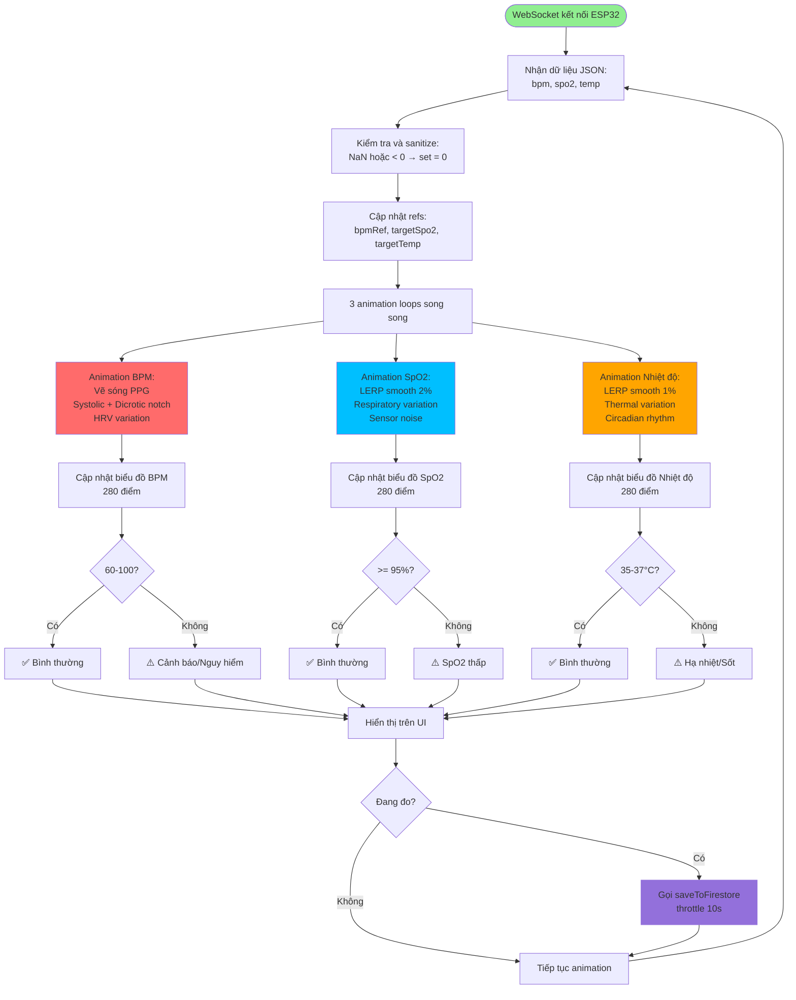
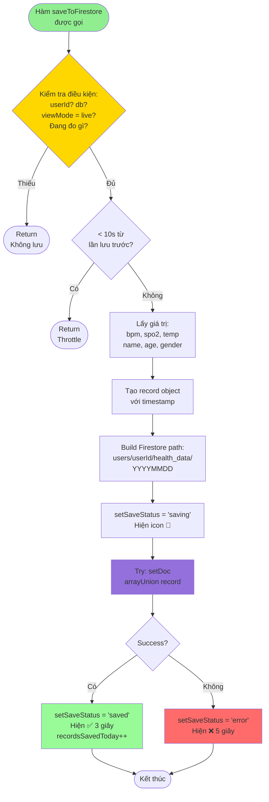
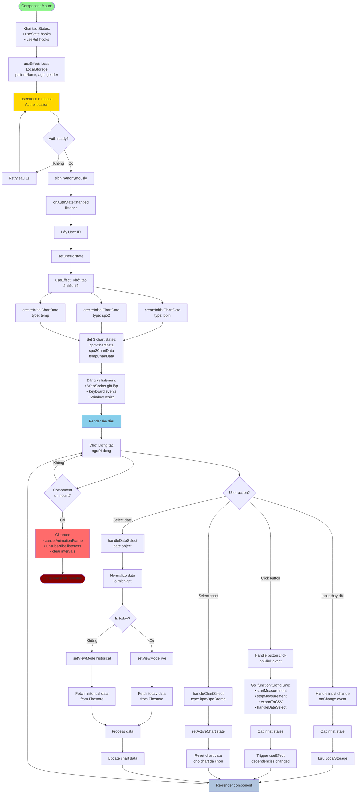
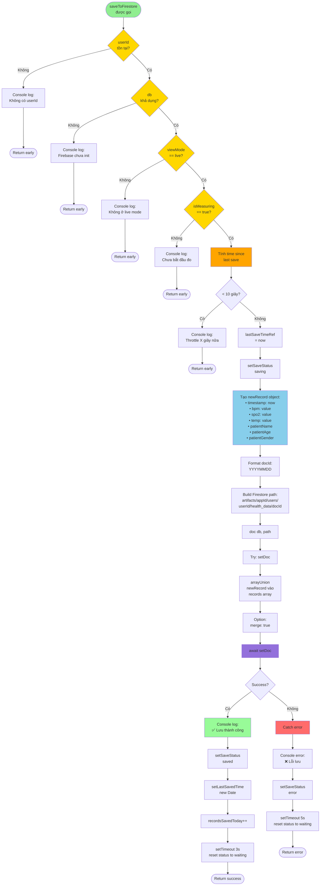
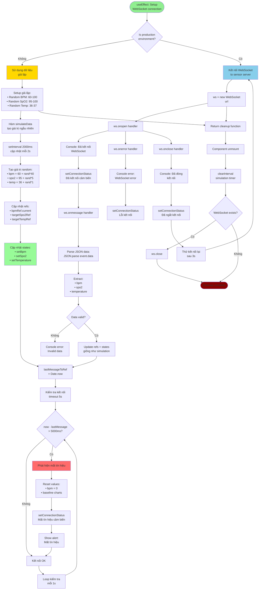

Lưu đồ xuất Excel

Lưu đồ này mô tả quy trình xuất dữ liệu sức khỏe ra file Excel. Hệ thống kiểm tra xem có dữ liệu cần xuất hay không, sau đó tạo các dòng tiêu đề, thông tin bệnh nhân và dữ liệu đo được. Mỗi bản ghi sẽ được xử lý, định dạng thời gian, tính trạng thái sức khỏe và sắp xếp vào các dòng dữ liệu. Các dòng này được kết hợp với tiêu đề để tạo thành bảng dữ liệu hoàn chỉnh. Hệ thống thiết lập độ rộng cột, chiều cao dòng, gộp các ô cần thiết và áp dụng các kiểu định dạng (màu sắc, font chữ) cho từng trạng thái (bình thường, cảnh báo, nguy hiểm). Cuối cùng, file Excel được tạo và tải về máy người dùng, giúp việc tổng hợp và báo cáo dữ liệu sức khỏe trở nên thuận tiện, trực quan.
Lưu đồ chọn chế độ đo

Lưu đồ này mô tả quy trình khi người dùng bắt đầu đo các chỉ số sức khỏe. Người dùng có thể lựa chọn đo tất cả các chỉ số cùng lúc hoặc đo riêng từng chỉ số (BPM, SpO2, Nhiệt độ). Hệ thống kiểm tra thông tin bệnh nhân trước khi bắt đầu đo, đảm bảo dữ liệu đầu vào hợp lệ. Khi đo, trạng thái hiển thị sẽ thay đổi tương ứng (ví dụ: "Đang đo: Tất cả" hoặc "Đang đo: BPM"). Dữ liệu đo được sẽ được lưu định kỳ lên Firebase, với các giá trị chưa đo sẽ hiển thị là "-" trong báo cáo Excel. Quy trình này giúp linh hoạt trong việc theo dõi sức khỏe, đáp ứng nhu cầu đo tổng hợp hoặc đo riêng lẻ từng chỉ số.
# 📊 LƯU ĐỒ HỆ THỐNG GIÁM SÁT SỨC KHỎE

> **Hướng dẫn đọc lưu đồ:**
> - 🟦 Hình chữ nhật: Quy trình/Hành động
> - 🔶 Hình thoi: Điều kiện/Quyết định
> - 🟢 Hình tròn: Bắt đầu/Kết thúc
> - ➡️ Mũi tên: Hướng luồng dữ liệu

---

## 1. LƯU ĐỒ TỔNG QUAN HỆ THỐNG

```mermaid
flowchart TD
    Start([Khởi động ứng dụng]) --> InitFirebase[Khởi tạo Firebase<br/>Config + Auth + Firestore]
    InitFirebase --> RegisterChart[Đăng ký Chart.js<br/>Components]
    RegisterChart --> InitStates[Khởi tạo States<br/>BPM, SpO2, Temp, UI States]
    InitStates --> CheckAuth{Firebase<br/>Auth?}
    
    CheckAuth -->|Chưa đăng nhập| SignInAnon[Đăng nhập ẩn danh<br/>signInAnonymously]
    CheckAuth -->|Đã đăng nhập| GetUserID[Lấy User ID]
    SignInAnon --> GetUserID
    
    GetUserID --> LoadLocalStorage[Tải dữ liệu từ<br/>LocalStorage<br/>Tên, Tuổi, Giới tính]
    LoadLocalStorage --> InitCharts[Khởi tạo 3 biểu đồ<br/>BPM, SpO2, Temp]
    
    InitCharts --> RenderUI[Render giao diện]
    RenderUI --> WaitInput{Chờ người dùng<br/>thao tác}
    
    WaitInput -->|Nhập thông tin| UpdatePatientInfo[Cập nhật thông tin<br/>bệnh nhân]
    UpdatePatientInfo --> SaveLocalStorage[Lưu vào LocalStorage]
    SaveLocalStorage --> WaitInput
    
    WaitInput -->|Bấm Bắt đầu đo| StartMeasurement[Bắt đầu phiên đo]
    WaitInput -->|Chọn biểu đồ| SwitchChart[Chuyển biểu đồ<br/>BPM/SpO2/Temp]
    WaitInput -->|Chọn ngày| HandleDate[Xử lý chọn ngày]
    WaitInput -->|Xuất Excel| ExportExcel[Xuất báo cáo Excel]
    
    StartMeasurement --> SetMeasuringTrue[isMeasuring = true<br/>Ghi nhận thời gian bắt đầu]
    SetMeasuringTrue --> StartAnimation[Bắt đầu animation<br/>3 biểu đồ]
    StartAnimation --> StartSaving[Bắt đầu lưu Firebase<br/>Mỗi 10 giây]
    
    SwitchChart --> UpdateActiveChart[Cập nhật activeChart]
    UpdateActiveChart --> RenderUI
    
    HandleDate --> CheckDateType{Ngày hôm nay?}
    CheckDateType -->|Có| SwitchLiveMode[Chế độ Live]
    CheckDateType -->|Không| SwitchHistoricalMode[Chế độ Lịch sử]
    
    SwitchLiveMode --> LoadTodayData[Tải dữ liệu hôm nay<br/>từ Firestore]
    SwitchHistoricalMode --> LoadHistoricalData[Tải dữ liệu lịch sử<br/>theo ngày được chọn]
Lưu đồ xử lý dữ liệu từ ESP32 và hiển thị

Dữ liệu từ ESP32 được gửi về qua WebSocket dưới dạng JSON, bao gồm các chỉ số sức khỏe như nhịp tim (BPM), SpO2 và nhiệt độ. Hệ thống sẽ kiểm tra và làm sạch dữ liệu, sau đó cập nhật các biến trạng thái và thực hiện hiệu ứng animation trực quan cho từng chỉ số. Các giá trị này được hiển thị liên tục trên giao diện, đồng thời hệ thống cũng kiểm tra ngưỡng an toàn để cảnh báo khi phát hiện bất thường. Nếu đang trong phiên đo, dữ liệu sẽ được lưu định kỳ lên Firebase để phục vụ theo dõi và xuất báo cáo.
    
    LoadTodayData --> RenderUI
    LoadHistoricalData --> CreateHistoricalChart[Tạo biểu đồ lịch sử]
    CreateHistoricalChart --> RenderUI
    
    ExportExcel --> CheckData{Có dữ liệu?}
    CheckData -->|Không| ShowAlert[Hiện thông báo lỗi]
    CheckData -->|Có| FormatExcel[Format dữ liệu Excel<br/>Header + Data + Styles]
    FormatExcel --> DownloadFile[Download file .xlsx]
    DownloadFile --> RenderUI
    ShowAlert --> RenderUI
    
    StartSaving --> CheckConditions{Kiểm tra điều kiện<br/>userId, isMeasuring,<br/>viewMode?}
    CheckConditions -->|Không đủ| WaitNext[Chờ chu kỳ tiếp theo]
    CheckConditions -->|Đủ điều kiện| SaveToFirestore[Lưu vào Firestore<br/>arrayUnion record]
    SaveToFirestore --> UpdateSaveStatus[Cập nhật trạng thái<br/>Saved/Error]
    UpdateSaveStatus --> WaitNext
    WaitNext --> StartSaving
    
    style Start fill:#90EE90
    style InitFirebase fill:#87CEEB
    style StartMeasurement fill:#FFD700
    style SaveToFirestore fill:#FF6B6B
    style ExportExcel fill:#9370DB
```

---

## 2. LƯU ĐỒ CHỌN CHẾ ĐỘ SỬ DỤNG

```mermaid
flowchart TD
    Start([Người dùng chọn ngày<br/>trên Calendar]) --> GetSelectedDate[Lấy ngày được chọn]
    GetSelectedDate --> NormalizeDate[Chuẩn hóa ngày<br/>về midnight local time]
    
    NormalizeDate --> GetToday[Lấy ngày hôm nay]
    GetToday --> FormatBoth[Format cả 2 ngày<br/>thành YYYYMMDD]
    
    FormatBoth --> CompareDates{Ngày được chọn<br/>== Hôm nay?}
    
    CompareDates -->|Có| LiveMode[Chuyển sang<br/>CHẾ ĐỘ LIVE]
    CompareDates -->|Không| HistoricalMode[Chuyển sang<br/>CHẾ ĐỘ LỊCH SỬ]
    
    LiveMode --> SetViewModeLive[viewMode = 'live']
    SetViewModeLive --> CheckFirebase{Firebase<br/>khả dụng?}
    
    CheckFirebase -->|Có| FetchTodayData[Fetch dữ liệu hôm nay<br/>từ Firestore]
    CheckFirebase -->|Không| ShowLiveAlert[Alert: Firebase<br/>đang kết nối]
    
    FetchTodayData --> HasTodayData{Có dữ liệu<br/>hôm nay?}
    HasTodayData -->|Có| ShowTodayHistory[Hiện popup<br/>lịch sử hôm nay]
    HasTodayData -->|Không| PromptStart[Alert: Hãy bấm<br/>Bắt đầu đo]
    
    ShowTodayHistory --> EnableLiveFeatures[Kích hoạt tính năng Live:<br/>✓ Biểu đồ real-time<br/>✓ Nút Bắt đầu/Dừng đo<br/>✓ Lưu Firebase<br/>✓ Xuất Excel hôm nay]
    PromptStart --> EnableLiveFeatures
    ShowLiveAlert --> EnableLiveFeatures
    
    EnableLiveFeatures --> StartLiveAnimation[Bắt đầu animation<br/>3 biểu đồ live]
    StartLiveAnimation --> DisplayLive[Hiển thị:<br/>• Sóng PPG real-time<br/>• SpO2 smooth<br/>• Temp smooth]
    
    HistoricalMode --> SetViewModeHistorical[viewMode = 'historical']
    SetViewModeHistorical --> FormatDocId[Format docId<br/>YYYYMMDD]
    FormatDocId --> FetchHistoricalData[Fetch dữ liệu<br/>từ Firestore<br/>theo ngày]
    
    FetchHistoricalData --> HasHistoricalData{Có dữ liệu<br/>ngày đó?}
    
    HasHistoricalData -->|Có| ProcessHistoricalData[Xử lý dữ liệu:<br/>• records array<br/>• Tính avg/min/max]
    HasHistoricalData -->|Không| ShowEmptyMessage[Hiện: Không có<br/>dữ liệu ngày này]
    
    ProcessHistoricalData --> CreateHistoricalChart[Tạo biểu đồ lịch sử<br/>từ records]
    CreateHistoricalChart --> DisableLiveFeatures[Vô hiệu hóa:<br/>✗ Nút Bắt đầu đo<br/>✗ Lưu Firebase<br/>✗ Animation real-time]
    
    DisableLiveFeatures --> EnableHistoricalFeatures[Kích hoạt:<br/>✓ Nút Xuất Excel<br/>✓ Hiện lịch sử chi tiết<br/>✓ Biểu đồ static]
    
Lifecycle App React

Quy trình hoạt động của ứng dụng React bắt đầu từ khi component được mount lên, khởi tạo các state và ref cần thiết, sau đó tải dữ liệu người dùng từ LocalStorage và thực hiện xác thực với Firebase. Khi xác thực thành công, hệ thống sẽ lấy User ID, khởi tạo các biểu đồ và đăng ký các listener (WebSocket, sự kiện bàn phím, thay đổi kích thước cửa sổ). Ứng dụng luôn lắng nghe các tương tác của người dùng như nhập liệu, chọn ngày, chọn biểu đồ, hoặc xuất báo cáo. Mỗi thay đổi sẽ cập nhật lại state, lưu vào LocalStorage và render lại giao diện. Khi component bị unmount, các listener và timer sẽ được dọn dẹp để đảm bảo hiệu năng và tránh rò rỉ bộ nhớ.
    ShowEmptyMessage --> DisableLiveFeatures
    
    EnableHistoricalFeatures --> DisplayHistorical[Hiển thị:<br/>• Biểu đồ tĩnh<br/>• Dữ liệu đã lưu<br/>• Thống kê]
    
    DisplayLive --> End([Kết thúc<br/>Đã chuyển chế độ])
    DisplayHistorical --> End
    
    style Start fill:#90EE90
    style LiveMode fill:#FFD700
    style HistoricalMode fill:#87CEEB
    style EnableLiveFeatures fill:#98FB98
    style EnableHistoricalFeatures fill:#B0C4DE
    style End fill:#FF6B6B
```

---

## 3. LƯU ĐỒ CHƯƠNG TRÌNH ĐO CHỈ SỐ SỨC KHỎE

### 3.1. Lưu đồ chọn chế độ đo

```mermaid
flowchart TD
    Start([Người dùng muốn đo]) --> CheckMode{Chọn chế độ đo?}
    
    CheckMode -->|Đo tất cả| StartAll[Bấm nút<br/>'Bắt đầu đo' chung]
    CheckMode -->|Đo riêng| SelectIndividual{Chọn chỉ số nào?}
    
    SelectIndividual -->|BPM| StartBPM[Bấm nút 'Đo'<br/>trên card BPM]
    SelectIndividual -->|SpO2| StartSPO2[Bấm nút 'Đo'<br/>trên card SpO2]
    SelectIndividual -->|Nhiệt độ| StartTemp[Bấm nút 'Đo'<br/>trên card Nhiệt độ]
    
    StartAll --> ValidateAll{Đã nhập tên<br/>bệnh nhân?}
    StartBPM --> ValidateBPM{Đã nhập tên<br/>bệnh nhân?}
    StartSPO2 --> ValidateSPO2{Đã nhập tên<br/>bệnh nhân?}
    StartTemp --> ValidateTemp{Đã nhập tên<br/>bệnh nhân?}
    
    ValidateAll -->|Không| ShowAlert1[Alert: Nhập tên trước!]
    ValidateBPM -->|Không| ShowAlert2[Alert: Nhập tên trước!]
    ValidateSPO2 -->|Không| ShowAlert3[Alert: Nhập tên trước!]
    ValidateTemp -->|Không| ShowAlert4[Alert: Nhập tên trước!]
    
    ShowAlert1 --> End1([Kết thúc])
    ShowAlert2 --> End1
    ShowAlert3 --> End1
    ShowAlert4 --> End1
    
    ValidateAll -->|Có| SetAllMeasuring[Set isMeasuring = true<br/>Tắt các đo riêng<br/>Ghi thời gian bắt đầu]
    ValidateBPM -->|Có| SetBPMMeasuring[Set isMeasuringBpm = true<br/>Ghi thời gian bắt đầu]
    ValidateSPO2 -->|Có| SetSPO2Measuring[Set isMeasuringSpo2 = true<br/>Ghi thời gian bắt đầu]
    ValidateTemp -->|Có| SetTempMeasuring[Set isMeasuringTemp = true<br/>Ghi thời gian bắt đầu]
    
    SetAllMeasuring --> MeasureAll[Đo cả 3 chỉ số:<br/>BPM + SpO2 + Nhiệt độ]
    SetBPMMeasuring --> MeasureBPM[Chỉ đo BPM<br/>SpO2, Temp = 0]
    SetSPO2Measuring --> MeasureSPO2[Chỉ đo SpO2<br/>BPM, Temp = 0]
    SetTempMeasuring --> MeasureTemp[Chỉ đo Nhiệt độ<br/>BPM, SpO2 = 0]
    
    MeasureAll --> DisplayStatus1[Hiện: 🔴 Đang đo: Tất cả]
    MeasureBPM --> DisplayStatus2[Hiện: 🔴 Đang đo: 💓 BPM]
    MeasureSPO2 --> DisplayStatus3[Hiện: 🔴 Đang đo: 🫁 SpO2]
    MeasureTemp --> DisplayStatus4[Hiện: 🔴 Đang đo: 🌡️ Nhiệt độ]
    
    DisplayStatus1 --> SaveLoop[Vòng lặp lưu Firebase<br/>Mỗi 10 giây]
    DisplayStatus2 --> SaveLoop
    DisplayStatus3 --> SaveLoop
    DisplayStatus4 --> SaveLoop
    
    SaveLoop --> CheckData{Có ít nhất 1<br/>giá trị > 0?}
    CheckData -->|Có| SaveToFirestore[Lưu vào Firebase<br/>Giá trị = 0 → xuất "-"]
    CheckData -->|Không| WaitNext[Chờ chu kỳ tiếp]
    
    SaveToFirestore --> ShowSaved[Hiện icon ✅<br/>Đã lưu]
    ShowSaved --> WaitNext
    WaitNext --> SaveLoop
    
    style Start fill:#90EE90
    style SetAllMeasuring fill:#FFD700
    style SetBPMMeasuring fill:#FF6B6B
    style SetSPO2Measuring fill:#00BFFF
    style SetTempMeasuring fill:#FFA500
    style SaveToFirestore fill:#9370DB
```

### 3.2. Lưu đồ xử lý dữ liệu từ ESP32 và hiển thị



### 3.3. Lưu đồ lưu dữ liệu Firebase (Chung cho tất cả)



---

## 4. LƯU ĐỒ CHƯƠNG TRÌNH APP

### 4.1. Lifecycle App React



### 4.2. Xử lý lưu dữ liệu Firebase



### 4.3. Xử lý xuất Excel

```mermaid
flowchart TD
    Start([exportToCSV<br/>được gọi]) --> CheckRecords{records.length<br/>> 0?}
    
    CheckRecords -->|Không| ShowAlert[alert: Không có<br/>dữ liệu để xuất]
    ShowAlert --> End1([Return])
    
    CheckRecords -->|Có| CountPatients[Đếm số bệnh nhân:<br/>new Set patientName]
    CountPatients --> CreateHeader[Tạo header rows:<br/>• Tiêu đề báo cáo<br/>• Tên cơ sở<br/>• Ngày xuất<br/>• Tổng số<br/>• Cột headers]
    
    CreateHeader --> MapRecords[Map records thành<br/>data rows]
    MapRecords --> ForEachRecord[For each record:]
    
    ForEachRecord --> ExtractData[Extract:<br/>• patientName<br/>• patientGender<br/>• patientAge<br/>• timestamp<br/>• bpm, spo2, temp]
    
    ExtractData --> FormatTime[Format timestamp:<br/>toLocaleString vi-VN]
    FormatTime --> CalcStatus[Tính trạng thái:<br/>getStatusText<br/>bpm, spo2, temp]
    
    CalcStatus --> CreateRow[Tạo array row:<br/>name, gender, age,<br/>time, bpm, spo2,<br/>temp, status]
    
    CreateRow --> NextRecord{Còn record?}
    NextRecord -->|Có| ForEachRecord
    NextRecord -->|Không| CombineData[Combine:<br/>header + data rows]
    
    CombineData --> CreateWorksheet[XLSX.utils.aoa_to_sheet<br/>array of arrays]
    CreateWorksheet --> SetColWidths[Set column widths:<br/>!cols property]
    SetColWidths --> SetRowHeights[Set row heights:<br/>!rows property]
    
    SetRowHeights --> CreateMerges[Tạo merge cells:<br/>• Title row<br/>• Subtitle row<br/>• Info rows<br/>• Patient names]
    
    CreateMerges --> ApplyMerges[ws !merges<br/>= merges array]
    ApplyMerges --> DefineStyles[Define styles:<br/>• titleStyle<br/>• headerStyle<br/>• dataStyle<br/>• warningStyle<br/>• criticalStyle]
    
    DefineStyles --> ApplyHeaderStyles[Apply styles<br/>cho header rows<br/>rows 1-5]
    
    ApplyHeaderStyles --> LoopDataRows[Loop qua data rows<br/>từ row 6]
    LoopDataRows --> CalcRowStatus[Tính status từ<br/>bpm, spo2, temp:<br/>normal/warning/critical]
    
    CalcRowStatus --> ChooseStyle{Status?}
    ChooseStyle -->|critical| UseCriticalStyle[rowStyle =<br/>criticalStyle<br/>đỏ nhạt, chữ đậm]
    ChooseStyle -->|warning| UseWarningStyle[rowStyle =<br/>warningStyle<br/>vàng nhạt]
    ChooseStyle -->|normal| UseNormalStyle[rowStyle =<br/>dataStyle/Alt<br/>xen kẽ trắng/xám]
    
    UseCriticalStyle --> ApplyCellStyles[Apply style cho<br/>từng cell A-H]
    UseWarningStyle --> ApplyCellStyles
    UseNormalStyle --> ApplyCellStyles
    
    ApplyCellStyles --> NextDataRow{Còn row?}
    NextDataRow -->|Có| LoopDataRows
    NextDataRow -->|Không| CreateWorkbook[XLSX.utils.book_new]
    
    CreateWorkbook --> AppendSheet[book_append_sheet<br/>ws, Dữ liệu sức khỏe]
    AppendSheet --> WriteFile[XLSX.writeFile<br/>workbook, filename]
    
    WriteFile --> TriggerDownload[Browser trigger<br/>download file .xlsx]
    TriggerDownload --> End2([Return success])
    
    style Start fill:#90EE90
    style CreateHeader fill:#87CEEB
    style DefineStyles fill:#FFA500
    style ApplyCellStyles fill:#9370DB
    style WriteFile fill:#FFD700
    style TriggerDownload fill:#98FB98
    style End2 fill:#98FB98
```



---

## 5. LƯU ĐỒ XỬ LÝ ALERT VÀ CẢNH BÁO

```mermaid
flowchart TD
    Start([useEffect triggered<br/>bpm, spo2, temp changed]) --> CheckViewMode{viewMode<br/>== live?}
    
    CheckViewMode -->|Không| Skip[Skip alert check<br/>chỉ check ở live mode]
    Skip --> End1([Return])
    
    CheckViewMode -->|Có| InitAlerts[alerts = array rỗng]
    InitAlerts --> CheckBPM{BPM > 100<br/>hoặc < 60?}
    
    CheckBPM -->|Có| AddBPMAlert[alerts.push<br/>Nhịp tim bất thường: X BPM]
    CheckBPM -->|Không| CheckSpO2{SpO2 < 95%?}
    AddBPMAlert --> CheckSpO2
    
    CheckSpO2 -->|Có| AddSpO2Alert[alerts.push<br/>SpO2 thấp: X%]
    CheckSpO2 -->|Không| CheckTempLow{Temp < 35°C?}
    AddSpO2Alert --> CheckTempLow
    
    CheckTempLow -->|Có| AddTempLowAlert[alerts.push<br/>Hạ nhiệt: X°C]
    CheckTempLow -->|Không| CheckTempHigh{Temp > 37°C?}
    AddTempLowAlert --> CheckTempHigh
    
    CheckTempHigh -->|Có| AddTempHighAlert[alerts.push<br/>Nhiệt độ cao: X°C]
    CheckTempHigh -->|Không| CheckAlertsLength{alerts.length<br/>> 0?}
    AddTempHighAlert --> CheckAlertsLength
    
    CheckAlertsLength -->|Không| NoAlert[Không có cảnh báo<br/>Tất cả bình thường]
    NoAlert --> End2([Return])
    
    CheckAlertsLength -->|Có| JoinAlerts[alertMessage =<br/>alerts.join | ]
    JoinAlerts --> SetMessage[setAlertMessage<br/>message]
    SetMessage --> ShowBanner[setShowAlert<br/>true]
    
    ShowBanner --> DisplayBanner[Hiển thị alert banner:<br/>• Icon ⚠️<br/>• Animation slide-in<br/>• Red background<br/>• Pulse effect]
    
    DisplayBanner --> SetTimeout[setTimeout 5000ms]
    SetTimeout --> AutoHide[setShowAlert false<br/>tự động ẩn sau 5s]
    
    AutoHide --> End3([Return])
    
    style Start fill:#90EE90
    style CheckBPM fill:#FFA500
    style CheckSpO2 fill:#FFA500
    style CheckTempLow fill:#FFA500
    style CheckTempHigh fill:#FFA500
    style DisplayBanner fill:#FF6B6B
    style AutoHide fill:#98FB98
```

---

## 6. LƯU ĐỒ XỬ LÝ WEBSOCKET (Giả lập)



---

## TÓM TẮT CÁC LƯU ĐỒ

### 📊 Lưu đồ 1: Tổng quan hệ thống
- **Mục đích**: Mô tả luồng hoạt động tổng thể từ khởi động đến các chức năng chính
- **Điểm chính**: Firebase init → Load data → Render UI → Handle user interactions

### 🔀 Lưu đồ 2: Chọn chế độ sử dụng
- **Mục đích**: Phân biệt Live Mode vs Historical Mode
- **Điểm chính**: Check ngày → Fetch data phù hợp → Enable/disable features

### 💓 Lưu đồ 3: Đo BPM, SpO2, Nhiệt độ
- **3.1 Đo BPM**: Animation sóng PPG + HRV + kiểm tra status
- **3.2 Đo SpO2**: LERP smooth + respiratory variation + alert
- **3.3 Đo Nhiệt độ**: LERP cực chậm + circadian rhythm + thermal variation
- **3.4 Lưu Firebase**: Vòng lặp 10s + throttle + validation
- **3.5 Chi tiết PPG**: Tính toán sóng mạch với systole, dicrotic notch
- **3.6 Chi tiết SpO2**: Smooth interpolation kỹ thuật

### 📱 Lưu đồ 4: Chương trình App
- **4.1 Lifecycle**: React component mount → effects → re-render → unmount
- **4.2 Firebase Save**: Validation → throttling → arrayUnion → status update
- **4.3 Excel Export**: Extract data → format → style → download

### ⚠️ Lưu đồ 5: Alert và cảnh báo
- **Mục đích**: Kiểm tra ngưỡng → hiển thị cảnh báo → tự động ẩn

### 🔌 Lưu đồ 6: WebSocket
- **Mục đích**: Kết nối cảm biến (giả lập) → nhận data → update UI → detect loss

---

## CÁCH ĐỌC LƯU ĐỒ TRÊN GITHUB

File này sử dụng **Mermaid syntax**, được GitHub hỗ trợ tự động render.

### Xem trên GitHub:
1. Push file này lên repository
2. Mở file trên GitHub web interface
3. Các lưu đồ sẽ tự động hiển thị dạng đồ họa

### Xem local:
- **VS Code**: Cài extension "Markdown Preview Mermaid Support"
- **Browser**: Sử dụng Mermaid Live Editor: https://mermaid.live/

---

## GHI CHÚ KỸ THUẬT

### Ký hiệu màu sắc trong lưu đồ:
- 🟢 **Xanh lá nhạt**: Start/Input
- 🟡 **Vàng**: Khởi tạo/Setup
- 🔵 **Xanh dương**: Processing/Calculation
- 🟣 **Tím**: Database operations
- 🔴 **Đỏ**: Error/Stop/Alert
- 🟢 **Xanh lá đậm**: Success/End

### Quy ước đặt tên:
- **camelCase**: Functions, variables
- **UPPER_CASE**: Constants
- **kebab-case**: Files, URLs

---

**Tài liệu được tạo bởi:** Đặng Văn Cấy & Đỗ Đức Duy  
**Trường:** Đại học Giao thông vận tải  
**Ngày:** 18/12/2025
chỉ số sức khỏe
- **3.1 Chọn chế độ đo**: Đo tất cả HOẶC đo riêng từng chỉ số (BPM/SpO2/Nhiệt độ)
- **3.2 Xử lý dữ liệu**: WebSocket → Animation (PPG/LERP smooth) → Hiển thị → Check status
- **3.3 Lưu Firebase**: Throttle 10s → Lưu với giá trị 0 thành "-" trong Excel

### 📱 Lưu đồ 4: Chương trình App
- **4.1 Lifecycle**: React component mount → effects → re-render → unmount
- **4.2 Firebase Save**: Validation → throttling → arrayUnion → status update
- **4.3 Excel Export**: Extract data → format → style → download

### ⚠️ Lưu đồ 5: Alert và cảnh báo
- **Mục đích**: Kiểm tra ngưỡng → hiển thị cảnh báo → tự động ẩn

### 🔌 Lưu đồ 6: WebSocket
- **Mục đích**: Kết nối ESP32## TÍNH NĂNG ĐẶC BIỆT

### 🎯 Đo riêng lẻ từng chỉ số
Hệ thống hỗ trợ 2 chế độ đo:
1. **Đo tất cả**: Bấm nút "Bắt đầu đo" → đo cả 3 chỉ số
2. **Đo riêng lẻ**: Bấm nút "Đo" trên từng card:
   - 💓 **Đo riêng BPM**: Chỉ lưu nhịp tim, SpO2 và Temp = 0 (hiển thị "-" trong Excel)
   - 🫁 **Đo riêng SpO2**: Chỉ lưu oxy máu, BPM và Temp = 0
   - 🌡️ **Đo riêng Nhiệt độ**: Chỉ lưu nhiệt độ, BPM và SpO2 = 0
   - Có thể đo kết hợp nhiều chỉ số (ví dụ: BPM + Nhiệt độ)

### 📊 Xuất Excel thông minh
- Giá trị = 0 hoặc không có → Hiển thị **"-"** 
- Trạng thái chỉ đánh giá các chỉ số **có giá trị > 0**
- Không báo lỗi khi chưa đo đủ 3 chỉ số

### 🔄 Trạng thái hiển thị động
- **Đang đo: Tất cả** (khi đo tổng)
- **Đang đo: 💓 BPM** (khi đo riêng BPM)
- **Đang đo: 🫁 SpO2** (khi đo riêng SpO2)
- **Đang đo: 🌡️ Nhiệt độ** (khi đo riêng nhiệt độ)
- **Đang đo: 💓 BPM + 🌡️ Nhiệt độ** (khi đo kết hợp)

---

**Tài liệu được tạo bởi:** Đặng Văn Cấy & Đỗ Đức Duy  
**Trường:** Đại học Giao thông vận tải  
**Ngày cập nhật:** 18/12/2025  
**Phiên bản:** 2.0 - Thêm tính năng đo riêng lẻ